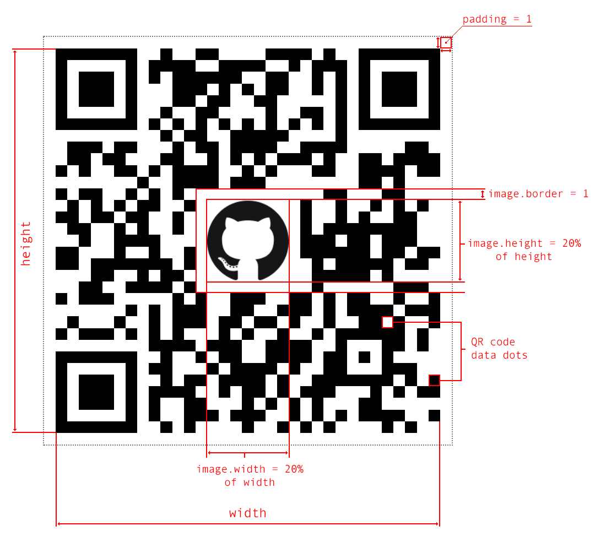

[](http://opensource.org/licenses/MIT)

@cheprasov/qrcode
=========

The library is for generating QR codes like SVG, HTML5 Canvas, PNG and JPG files, or text.

#### Features:
- The library has classes for generation SVG, Canvas, PNG / JPG or text with QR code.
- it is easy to use and configure (error correction level, type number, padding and so on).
- Supports inverting of data.
- The library is covered by tests.
- Easy to extend the classes or create own class for generation QR code.

- SVG (see [class `QRCodeSVG`](#33-class-qrcodesvg))
    - Returns generated QR code as SVG (xml) or DataURL.
    - Optimized SVG structure for xml and for DataURL.
    - Supports adding an image (logo) to QR code (allows to use url, dataUrl, Image, Canvas). See [example](#23-qr-code-with-image)
    - Allows to specify relative/abcolute position/size of image on QR code.

- Canvas (see [class `QRCodeCanvas`](#32-class-qrcodecanvas))
    - Draws QR code on provided canvas or returns new canvas element with QR code.
    - Allows to get PNG / JPG files with QR code like dataUrl.
    - Supports adding a image (logo) to QR code (allows to use url, dataUrl, Image, Canvas).
    - Has image loader for images for QR code via Promise.
    - It is possible to specify scale or canvas size.
    - Allows to specify relative/abcolute position/size of image on QR code.

- Text (see [class `QRCodeText`](34-class-qrcodetext))
    - It is possible to create QR code for consoles or text output.


#### Plans to do:

- To add possibility to use patterns, themes and flexible customisation of QR code.
- to add support of rgb & rgba format for canvas colors.

### 1. How to install

```bash
> npm install @cheprasov/qrcode
```

```javascript
import { QRCodeRaw, QRCodeSVG, QRCodeCanvas, QRCodeText } from '@cheprasov/qrcode';
```

### 2. Quick examples

#### 2.1. Create SVG QR Code
```javascript
import { QRCodeSVG } from '@cheprasov/qrcode';

const qrSVG = new QRCodeSVG('some value for QR code');
const dataUrlWithSVGQRCode = qrSVG.toDataUrl();
const xmlWithQRCode = qrSVG.toString();
```

#### 2.2. Create Image QR Code
```javascript
import { QRCodeCanvas } from '@cheprasov/qrcode';

const qrCanvas = new QRCodeCanvas('some value for QR code');
const dataUrlWithQRCode = qrCanvas.toDataUrl();
const canvasWithQRCode = qrCanvas.getCanvas();
```

#### 2.3. QR Code with Image
```javascript
import { QRCodeSVG } from '@cheprasov/qrcode';

const divElement = document.getElementById('some-id');

const qrSVG = new QRCodeSVG('https://github.com/cheprasov/js-qrcode/', {
    level: 'Q',
    image: {
        source: 'GitHub-Mark-120px-plus.png',
        width: '20%',
        height: '20%',
        x: 'center',
        y: 'center',
    },
});
divElement.innerHTML = qrSVG.toString();
```
Result:

Note, padding & image.border = 1 by default.



### 3. Documentation

#### 3.1. class `QRCodeRaw`

The class base class for all QR code generators, returns raw data with information about QR dots and padding.

```javascript
import { QRCodeRaw } from '@cheprasov/qrcode';
```

Public methods:

#### `constructor(value: string, config: object)`
Create new instance of QRCodeRaw

Params:
- `value` (string) - new value for encoding to QR code
- `config` (object, optional) - parameters of configuration
    - `level` (string, optional, default = `L`) - error correction level. Note, the level affects QR Code data size. Allowed values:
        - `L` - Allows recovery of up to 7% data loss
        - `M` - Allows recovery of up to 15% data loss
        - `Q` - Allows recovery of up to 25% data loss
        - `H` - Allows recovery of up to 30% data loss

    - `typeNumber` (number, optional, default = `0`) - data capacity type, see details in [appendix 4.1](#41-data-capacity-in-bytes). Type number (`1` ~ `40`), or `0` for auto detection.
    - `invert` (boolean, optional, default = `false`) - inverting data of QR code.
    - `padding` (number, optional, default = `1`) - count of white spaces on sides QR code. 1 unit has size like 1 information dot.
    - `errorsEnabled`: (boolean, optional, default = `false`) - if it is enabled and QR code generator can not create a QR Code then an error will thrown. If it is disabled then methods will return `null` of fail.

#### `setValue(value: string): void`
Set new value for encoding to QR code

Params:
- `value` (string) - new value for encoding to QR code

#### `getDataSize(): number`
Get size of QR code width / height (width and height are equal)
Method will return `0` if QR code can not be generated by some reasons.

#### `getData(): boolean[][]`
Get raw data of QR code.
Method will return `null` if QR code can not be generated by some reasons.

Example:
```javascript
import { QRCodeRaw } from '@cheprasov/qrcode';

const config = {
    level: 'H', // use high error correction level
    padding: 0, // do not use padding around qr code data
};

const qrRaw = new QRCodeRaw('some value', config);
const qrCodeRaw = qrRaw.getData();
if (qrCodeRaw) {
    console.log(qrCodeRaw);
    // [
    //   0: [true, true, true, true, ... true],
    //   1: [true, false, false, false, ... true],
    //   ...
    //   24: [true, true, true, ... true],
    // ]
}
```

#### 3.2. class `QRCodeCanvas`

The QR code generator based on HTML5 Canvas. It can create a canvas with QR code, or PNG/JPG data url.
The class extends [`QRCodeRaw`](31-class-qrcoderaw), therefore please see there description about public method and configuration params.

```javascript
import { QRCodeCanvas } from '@cheprasov/qrcode';
```

Public methods:

#### `constructor(value: string, config: object)`
Create new instance of QRCodeCanvas. Please see config description of [`QRCodeRaw.constructor`](#constructorvalue-string-config-object).

Config has additional parameters:
- `config` (object, optional) - parameters of configuration
    - see config of [`QRCodeRaw.constructor`](#constructorvalue-string-config-object)
    - `fgColor` (string, optional, default = `#000`) - foreground color of the QR code, is it allowed to use the next formats:
        - `RGB` or `#RGB`, example: `#ABC`, will be converted to `#AABBCC`
        - `RGBA` or `#RGBA`, example: `#ABCD`, will be converted to `#AABBCCDD`
        - `RRGGBB` or `#RRGGBB`, example: `#AABBCC`
        - `RRGGBBAA` or `#RRGGBBAA`, example: `#AABBCCDD`
        - Other formats (like `red`, `rgb(...)`, `rgba(...)`) are not supported and will be converted to `#0000`
    - `bgColor` (string, optional, default = `#FFF`) - background color of the QR code, see description of `fgColor`.
    - `scale` (number, optional, default = `10`) - scale size of QR code. For example, when scale is 5 then QR generator will use 5 pixel for draw 1 data dot.
    - `size` (number, optional, default = `null`) - size (width & height) of canvas in pixels. If size is specified then scale param will be ignored. Note, that the original canvas with QR code will be stretched to the specified size. See [image scheme](#23-qr-code-with-image)
    - `image` (object, optional, default = `null`) - parameters on an image, that should be added to QR code, like logo.
        - `source` (string|Image|Canvas) - source of image for QR Code, allowed to use the next types:
            - `string` - url to resource or dataUrl of image.
            - `Image` - it is allowed to use Image. The image's src should be loaded before use it.
            - `Canvas` - allowed to use HTML5 canvas element.
        - `width` (number|string) - width of the image in QR code dots (not a pixel), allowed formats:
            - `<number>` - defines the width of image, example: `width: 30`
            - `<number>%` - defines the width in percent of QR code without padding, example: `width: '20%'`
            - `height` (number|string) - height of the image in QR code dots, see `width`
        - `x` (number|string, optional, default = `0`) - position of image on QR code by horizontal in QR code dots (not a pixel), allowed formats:
            - `<number>` - sets the left edge position from left to right, example: `x: 10`
            - `<number>%` - sets the left edge position in % of QR code without padding. Negative values are allowed. Example: `x: '50%'`
            - `left` -  aligns the image to the left, example: `x: 'left'`
            - `right` -  aligns the image to the right, example: `x: 'right'`
            - `center` - Centers the image in center of QR code,  example: `x: 'center'`
            - `left <number>` - the same as `<number>`
            - `left <number> %` - the same as `<number>%`
            - `right <number>` - sets the right edge position from right to left, example: `x: 'right 5'`
            - `right <number>%` - sets the tight edge position in % of QR code without padding, example: `x: 'right 10%'`
        - `y` (number|string, optional, default = `0`) - position of image on QR code by vertical in QR code dots (not a pixel), allowed formats:
            - `<number>` - sets the top edge position from top to bottom, example: `y: 10`
            - `<number>%` - sets the top edge position in % of QR code without padding. Negative values are allowed. Example: `y: '50%'`
            - `top` -  aligns the image to the top, example: `y: 'top'`
            - `bottom` -  aligns the image to the bottom, example: `y: 'bottom'`
            - `center` - Centers the image in center of QR code,  example: `y: 'center'`
            - `top <number>` - the same as `<number>`
            - `top <number> %` - the same as `<number>%`
            - `bottom <number>` - sets the bottom edge position from bottom to top, example: `y: 'bottom 5'`
            - `bottom <number>%` - sets the bottom edge position in % of QR code without padding, example: `y: 'bottom 10%'`
        - `border` (number|null, optional, default = 1) - white space length around the images in dots. Negative values are allowed.
            - use `0` - for white space only under the image
            - use `null` to remove any white spaces under image and leave QR data dots

#### `draw(canvas: HTMLCanvasElement = null): null | HTMLCanvasElement| Promise`
Draws QR code on a canvas element and return the canvas if the canvas is provided, or returns a new canvas element if canvas is not provided (see `getCanvas()`).
If QR code can not be generated then `null` will be returned.
If `config.image` is provided AND `config.image.source` is `string` (url or dataUrl) then a promise will be returned with a canvas as result.

#### `getCanvas(): null | HTMLCanvasElement | Promise`
Returns new canvas element with QR code. If QR code can not be generated then `null` will be returned.
If `config.image` is provided AND `config.image.source` is `string` (url or dataUrl) then a promise will be returned with a canvas as result.

#### `toDataUrl(type: string = 'image/png', encoderOptions: number = 0.92): null | string | Promise`
Allowed alias: `toDataURL(...)`
Returns dataUrl with QR code. If QR code can not be generated then `null` will be returned.
If `config.image` is provided AND `config.image.source` is `string` (url or dataUrl) then a promise will be returned with a dataUrl as result.
See params descriptions here: https://developer.mozilla.org/en-US/docs/Web/API/HTMLCanvasElement/toDataURL

Example
```javascript
import { QRCodeCanvas } from '@cheprasov/qrcode';

const qrCanvas = new QRCodeCanvas('some value');
const dataUrl = qrCanvas.toDataUrl();
console.log(dataUrl); // data:image/png;base64,iVBORw0KGgoAAAA...g==
```

Example with promise
```javascript
import { QRCodeCanvas } from '@cheprasov/qrcode';

// Example with promise
const config = {
    level: 'H', // use high error correction level
    padding: 0, // do not use padding around qr code data,
    image: {
        source: 'https://some-url.com/foo.png', // or data:image/jpeg;base64,...
        width: '10%',
        height: '10%',
        x: 'center',
        y: 'center',
    }
};

const qrCanvas = new QRCodeCanvas('some value', config);
const promise = qrCanvas.toDataUrl();
// promise is returned because image.source is a string
promise.then((dataUrl) => {
    console.log(dataUrl); // data:image/png;base64,iVBORw0KGgoAAAAN...
});
```

#### 3.3. class `QRCodeSVG`

The class creates QR code as SVG in string or data url formats.
The class extends [`QRCodeRaw`](31-class-qrcoderaw), therefore please see there description about public method and configuration params.

```javascript
import { QRCodeSVG } from '@cheprasov/qrcode';
```

Public methods:

#### `constructor(value: string, config: object)`
Create new instance of QRCodeSVG. Please see config description of [`QRCodeRaw.constructor`](#constructorvalue-string-config-object).

Config has additional parameters:
- `config` (object, optional) - parameters of configuration
    - see config of [`QRCodeRaw.constructor`](#constructorvalue-string-config-object)
    - `fgColor` (string, optional, default = `#000`) - foreground color of the QR code in CSS format
    - `bgColor` (string, optional, default = `#FFF`) - background color of the QR code in CSS format
    - `image` (object, optional, default = `null`) - parameters on an image, that should be added to QR code, like logo. See [image scheme](#23-qr-code-with-image)
        - `source` (string|Image|Canvas) - source of image for QR Code, allowed to use the next types:
            - `string` - url to resource or dataUrl of image.
            - `Image` - it is allowed to use Image. It is not necessary to have loaded image.
            - `Canvas` - allowed to use HTML5 canvas element.
        - `width` (number|string) - width of the image in QR code dots (not a pixel), allowed formats:
            - `<number>` - defines the width of image, example: `width: 30`
            - `<number>%` - defines the width in percent of QR code without padding, example: `width: '20%'`
            - `height` (number|string) - height of the image in QR code dots, see `width`
        - `x` (number|string, optional, default = `0`) - position of image on QR code by horizontal in QR code dots (not a pixel), allowed formats:
            - `<number>` - sets the left edge position from left to right, example: `x: 10`
            - `<number>%` - sets the left edge position in % of QR code without padding. Negative values are allowed. Example: `x: '50%'`
            - `left` -  aligns the image to the left, example: `x: 'left'`
            - `right` -  aligns the image to the right, example: `x: 'right'`
            - `center` - Centers the image in center of QR code,  example: `x: 'center'`
            - `left <number>` - the same as `<number>`
            - `left <number> %` - the same as `<number>%`
            - `right <number>` - sets the right edge position from right to left, example: `x: 'right 5'`
            - `right <number>%` - sets the tight edge position in % of QR code without padding, example: `x: 'right 10%'`
        - `y` (number|string, optional, default = `0`) - position of image on QR code by vertical in QR code dots (not a pixel), allowed formats:
            - `<number>` - sets the top edge position from top to bottom, example: `y: 10`
            - `<number>%` - sets the top edge position in % of QR code without padding. Negative values are allowed. Example: `y: '50%'`
            - `top` -  aligns the image to the top, example: `y: 'top'`
            - `bottom` -  aligns the image to the bottom, example: `y: 'bottom'`
            - `center` - Centers the image in center of QR code,  example: `y: 'center'`
            - `top <number>` - the same as `<number>`
            - `top <number> %` - the same as `<number>%`
            - `bottom <number>` - sets the bottom edge position from bottom to top, example: `y: 'bottom 5'`
            - `bottom <number>%` - sets the bottom edge position in % of QR code without padding, example: `y: 'bottom 10%'`
        - `border` (number|null, optional, default = 1) - white space length around the images in dots. Negative values are allowed.
            - use `0` - for white space only under the image
            - use `null` to remove any white spaces under image and leave QR data dots

#### `toString(): null | string`
Returns SVG with QR code as string. If QR code can not be generated then `null` will be returned.

#### `toDataUrl(): null | string`
Allowed alias: `toDataURL(...)`
Returns SVG with QR code as dataUrl (string). If QR code can not be generated then `null` will be returned.

Example
```javascript
import { QRCodeSVG } from '@cheprasov/qrcode';

const qrSVG = new QRCodeSVG('some value');
const dataUrl = qrSVG.toDataUrl();
console.log(dataUrl); // data:image/png;base64,iVBORw0KGgoAAAA...g==
```

Example with image
```javascript
import { QRCodeSVG } from '@cheprasov/qrcode';

const config = {
    level: 'M', // use high error correction level
    padding: 0, // do not use padding around qr code data,
    image: {
        source: 'https://some-url.com/foo.png', // or data:image/jpeg;base64,...
        width: '10%',
        height: '10%',
        x: 'center',
        y: 'center',
    }
};

const qrSVG = new QRCodeSVG('some value', config);
const svg = qrSVG.toString();
console.log(svg);
// output:
// <svg xmlns="http://www.w3.org/2000/svg" xmlns:xlink="http://www.w3.org/1999/xlink" version="1.1" shape-rendering="crispEdges" viewBox="0 0 21 21">
// <rect x="0" y="0" height="21" width="21" fill="#FFF"/>
// <rect x="0" y="0" height="1" width="7" fill="#000"/>
// <rect x="9" y="0" height="1" width="2" fill="#000"/>
// ...
// <image xlink:href="https://some-url.com/foo.png" x="10" y="10" width="2" height="2"/>
// </svg>
```

#### 3.4. class `QRCodeText`

The class creates QR code as text. It is possible to show QR code in terminal.
The class extends [`QRCodeRaw`](31-class-qrcoderaw), therefore please see there description about public method and configuration params.

```javascript
import { QRCodeSVG } from '@cheprasov/qrcode';
```

Public methods:

#### `constructor(value: string, config: object)`
Create new instance of QRCodeSVG. Please see config description of [`QRCodeRaw.constructor`](#constructorvalue-string-config-object).

Config has additional parameters:
- `config` (object, optional) - parameters of configuration
    - see config of [`QRCodeRaw.constructor`](#constructorvalue-string-config-object)
    - `blackSymbol` (string, optional, default = `▓▓`) - symbol(s) for black QR code dot.
    - `whiteSymbol` (string, optional, default = `  `) - symbol(s) for white QR code dot.

#### `toString(): null | string `
Returns QR code as string. If QR code can not be generated then `null` will be returned.

Example
```javascript
import { QRCodeText } from '@cheprasov/qrcode';

const qrText = new QRCodeText('some value', {
    blackSymbol: '@@',
    whiteSymbol: '..',
});
const qrCode = qrText.toString();
console.log(qrCode);

// ..............................................
// ..@@@@@@@@@@@@@@..@@@@@@@@@@..@@@@@@@@@@@@@@..
// ..@@..........@@..@@@@..@@@@..@@..........@@..
// ..@@..@@@@@@..@@....@@@@@@....@@..@@@@@@..@@..
// ..@@..@@@@@@..@@....@@..@@@@..@@..@@@@@@..@@..
// ..@@..@@@@@@..@@..@@......@@..@@..@@@@@@..@@..
// ..@@..........@@..@@..@@......@@..........@@..
// ..@@@@@@@@@@@@@@..@@..@@..@@..@@@@@@@@@@@@@@..
// ..................@@@@@@@@....................
// ..@@@@@@....@@@@..@@@@@@@@@@@@@@@@@@....@@@@..
// ..@@@@@@@@..@@..@@..........@@@@..@@@@@@..@@..
// ..@@......@@..@@@@..@@@@....@@@@..@@......@@..
// ......@@..@@@@..@@........@@@@..@@..@@..@@@@..
// ....@@..@@@@@@@@..@@............@@@@@@..@@@@..
// ..................@@@@@@@@..@@....@@@@@@@@@@..
// ..@@@@@@@@@@@@@@........@@@@..@@..@@..@@..@@..
// ..@@..........@@..@@@@@@@@..@@....@@@@....@@..
// ..@@..@@@@@@..@@....@@..@@@@@@....@@@@..@@....
// ..@@..@@@@@@..@@......@@....@@..@@@@@@........
// ..@@..@@@@@@..@@..@@..........@@..@@..@@@@@@..
// ..@@..........@@..@@......@@..................
// ..@@@@@@@@@@@@@@..@@@@......@@@@@@@@@@....@@..
// ..............................................

```

### 4. Appendix

#### 4.1. Data capacity in bytes

<table>
    <thead>
        <tr>
            <th rowspan="2">TypeNumber</th>
            <th colspan="4">Numeric</th>
            <th colspan="4">Alphanumeric</th>
            <th colspan="4">Byte</th>
            <th colspan="4">Kanji</th>
        </tr>
        <tr>
            <th>L</th><th>M</th><th>Q</th><th>H</th><th>L</th><th>M</th><th>Q</th><th>H</th><th>L</th><th>M</th><th>Q</th><th>H</th><th>L</th><th>M</th><th>Q</th><th>H</th>
        </tr>
    </thead>
    <tbody>
        <tr>
            <td>1</td><td>41</td><td>34</td><td>27</td><td>17</td><td>25</td><td>20</td><td>16</td><td>10</td><td>17</td><td>14</td><td>11</td><td>7</td><td>10</td><td>8</td><td>7</td><td>4</td>
        </tr>
        <tr>
            <td>2</td><td>77</td><td>63</td><td>48</td><td>34</td><td>47</td><td>38</td><td>29</td><td>20</td><td>32</td><td>26</td><td>20</td><td>14</td><td>20</td><td>16</td><td>12</td><td>8</td>
        </tr>
        <tr>
            <td>3</td><td>127</td><td>101</td><td>77</td><td>58</td><td>77</td><td>61</td><td>47</td><td>35</td><td>53</td><td>42</td><td>32</td><td>24</td><td>32</td><td>26</td><td>20</td><td>15</td>
        </tr>
        <tr>
            <td>4</td><td>187</td><td>149</td><td>111</td><td>82</td><td>114</td><td>90</td><td>67</td><td>50</td><td>78</td><td>62</td><td>46</td><td>34</td><td>48</td><td>38</td><td>28</td><td>21</td>
        </tr>
        <tr>
            <td>5</td><td>255</td><td>202</td><td>144</td><td>106</td><td>154</td><td>122</td><td>87</td><td>64</td><td>106</td><td>84</td><td>60</td><td>44</td><td>65</td><td>52</td><td>37</td><td>27</td>
        </tr>
        <tr>
            <td>6</td><td>322</td><td>255</td><td>178</td><td>139</td><td>195</td><td>154</td><td>108</td><td>84</td><td>134</td><td>106</td><td>74</td><td>58</td><td>82</td><td>65</td><td>45</td><td>36</td>
        </tr>
        <tr>
            <td>7</td><td>370</td><td>293</td><td>207</td><td>154</td><td>224</td><td>178</td><td>125</td><td>93</td><td>154</td><td>122</td><td>86</td><td>64</td><td>95</td><td>75</td><td>53</td><td>39</td>
        </tr>
        <tr>
            <td>8</td><td>461</td><td>365</td><td>259</td><td>202</td><td>279</td><td>221</td><td>157</td><td>122</td><td>192</td><td>152</td><td>108</td><td>84</td><td>118</td><td>93</td><td>66</td><td>52</td>
        </tr>
        <tr>
            <td>9</td><td>552</td><td>432</td><td>312</td><td>235</td><td>335</td><td>262</td><td>189</td><td>143</td><td>230</td><td>180</td><td>130</td><td>98</td><td>141</td><td>111</td><td>80</td><td>60</td>
        </tr>
        <tr>
            <td>10</td><td>652</td><td>513</td><td>364</td><td>288</td><td>395</td><td>311</td><td>221</td><td>174</td><td>271</td><td>213</td><td>151</td><td>119</td><td>167</td><td>131</td><td>93</td><td>74</td>
        </tr>
        <tr>
            <td>11</td><td>772</td><td>604</td><td>427</td><td>331</td><td>468</td><td>366</td><td>259</td><td>200</td><td>321</td><td>251</td><td>177</td><td>137</td><td>198</td><td>155</td><td>109</td><td>85</td>
        </tr>
        <tr>
            <td>12</td><td>883</td><td>691</td><td>489</td><td>374</td><td>535</td><td>419</td><td>296</td><td>227</td><td>367</td><td>287</td><td>203</td><td>155</td><td>226</td><td>177</td><td>125</td><td>96</td>
        </tr>
        <tr>
            <td>13</td><td>1022</td><td>796</td><td>580</td><td>427</td><td>619</td><td>483</td><td>352</td><td>259</td><td>425</td><td>331</td><td>241</td><td>177</td><td>262</td><td>204</td><td>149</td><td>109</td>
        </tr>
        <tr>
            <td>14</td><td>1101</td><td>871</td><td>621</td><td>468</td><td>667</td><td>528</td><td>376</td><td>283</td><td>458</td><td>362</td><td>258</td><td>194</td><td>282</td><td>223</td><td>159</td><td>120</td>
        </tr>
        <tr>
            <td>15</td><td>1250</td><td>991</td><td>703</td><td>530</td><td>758</td><td>600</td><td>426</td><td>321</td><td>520</td><td>412</td><td>292</td><td>220</td><td>320</td><td>254</td><td>180</td><td>136</td>
        </tr>
        <tr>
            <td>16</td><td>1408</td><td>1082</td><td>775</td><td>602</td><td>854</td><td>656</td><td>470</td><td>365</td><td>586</td><td>450</td><td>322</td><td>250</td><td>361</td><td>277</td><td>198</td><td>154</td>
        </tr>
        <tr>
            <td>17</td><td>1548</td><td>1212</td><td>876</td><td>674</td><td>938</td><td>734</td><td>531</td><td>408</td><td>644</td><td>504</td><td>364</td><td>280</td><td>397</td><td>310</td><td>224</td><td>173</td>
        </tr>
        <tr>
            <td>18</td><td>1725</td><td>1346</td><td>948</td><td>746</td><td>1046</td><td>816</td><td>574</td><td>452</td><td>718</td><td>560</td><td>394</td><td>310</td><td>442</td><td>345</td><td>243</td><td>191</td>
        </tr>
        <tr>
            <td>19</td><td>1903</td><td>1500</td><td>1063</td><td>813</td><td>1153</td><td>909</td><td>644</td><td>493</td><td>792</td><td>624</td><td>442</td><td>338</td><td>488</td><td>384</td><td>272</td><td>208</td>
        </tr>
        <tr>
            <td>20</td><td>2061</td><td>1600</td><td>1159</td><td>919</td><td>1249</td><td>970</td><td>702</td><td>557</td><td>858</td><td>666</td><td>482</td><td>382</td><td>528</td><td>410</td><td>297</td><td>235</td>
        </tr>
        <tr>
            <td>21</td><td>2232</td><td>1708</td><td>1224</td><td>969</td><td>1352</td><td>1035</td><td>742</td><td>587</td><td>929</td><td>711</td><td>509</td><td>403</td><td>572</td><td>438</td><td>314</td><td>248</td>
        </tr>
        <tr>
            <td>22</td><td>2409</td><td>1872</td><td>1358</td><td>1056</td><td>1460</td><td>1134</td><td>823</td><td>640</td><td>1003</td><td>779</td><td>565</td><td>439</td><td>618</td><td>480</td><td>348</td><td>270</td>
        </tr>
        <tr>
            <td>23</td><td>2620</td><td>2059</td><td>1468</td><td>1108</td><td>1588</td><td>1248</td><td>890</td><td>672</td><td>1091</td><td>857</td><td>611</td><td>461</td><td>672</td><td>528</td><td>376</td><td>284</td>
        </tr>
        <tr>
            <td>24</td><td>2812</td><td>2188</td><td>1588</td><td>1228</td><td>1704</td><td>1326</td><td>963</td><td>744</td><td>1171</td><td>911</td><td>661</td><td>511</td><td>721</td><td>561</td><td>407</td><td>315</td>
        </tr>
        <tr>
            <td>25</td><td>3057</td><td>2395</td><td>1718</td><td>1286</td><td>1853</td><td>1451</td><td>1041</td><td>779</td><td>1273</td><td>997</td><td>715</td><td>535</td><td>784</td><td>614</td><td>440</td><td>330</td>
        </tr>
        <tr>
            <td>26</td><td>3283</td><td>2544</td><td>1804</td><td>1425</td><td>1990</td><td>1542</td><td>1094</td><td>864</td><td>1367</td><td>1059</td><td>751</td><td>593</td><td>842</td><td>652</td><td>462</td><td>365</td>
        </tr>
        <tr>
            <td>27</td><td>3517</td><td>2701</td><td>1933</td><td>1501</td><td>2132</td><td>1637</td><td>1172</td><td>910</td><td>1465</td><td>1125</td><td>805</td><td>625</td><td>902</td><td>692</td><td>496</td><td>385</td>
        </tr>
        <tr>
            <td>28</td><td>3669</td><td>2857</td><td>2085</td><td>1581</td><td>2223</td><td>1732</td><td>1263</td><td>958</td><td>1528</td><td>1190</td><td>868</td><td>658</td><td>940</td><td>732</td><td>534</td><td>405</td>
        </tr>
        <tr>
            <td>29</td><td>3909</td><td>3035</td><td>2181</td><td>1677</td><td>2369</td><td>1839</td><td>1322</td><td>1016</td><td>1628</td><td>1264</td><td>908</td><td>698</td><td>1002</td><td>778</td><td>559</td><td>430</td>
        </tr>
        <tr>
            <td>30</td><td>4158</td><td>3289</td><td>2358</td><td>1782</td><td>2520</td><td>1994</td><td>1429</td><td>1080</td><td>1732</td><td>1370</td><td>982</td><td>742</td><td>1066</td><td>843</td><td>604</td><td>457</td>
        </tr>
        <tr>
            <td>31</td><td>4417</td><td>3486</td><td>2473</td><td>1897</td><td>2677</td><td>2113</td><td>1499</td><td>1150</td><td>1840</td><td>1452</td><td>1030</td><td>790</td><td>1132</td><td>894</td><td>634</td><td>486</td>
        </tr>
        <tr>
            <td>32</td><td>4686</td><td>3693</td><td>2670</td><td>2022</td><td>2840</td><td>2238</td><td>1618</td><td>1226</td><td>1952</td><td>1538</td><td>1112</td><td>842</td><td>1201</td><td>947</td><td>684</td><td>518</td>
        </tr>
        <tr>
            <td>33</td><td>4965</td><td>3909</td><td>2805</td><td>2157</td><td>3009</td><td>2369</td><td>1700</td><td>1307</td><td>2068</td><td>1628</td><td>1168</td><td>898</td><td>1273</td><td>1002</td><td>719</td><td>553</td>
        </tr>
        <tr>
            <td>34</td><td>5253</td><td>4134</td><td>2949</td><td>2301</td><td>3183</td><td>2506</td><td>1787</td><td>1394</td><td>2188</td><td>1722</td><td>1228</td><td>958</td><td>1347</td><td>1060</td><td>756</td><td>590</td>
        </tr>
        <tr>
            <td>35</td><td>5529</td><td>4343</td><td>3081</td><td>2361</td><td>3351</td><td>2632</td><td>1867</td><td>1431</td><td>2303</td><td>1809</td><td>1283</td><td>983</td><td>1417</td><td>1113</td><td>790</td><td>605</td>
        </tr>
        <tr>
            <td>36</td><td>5836</td><td>4588</td><td>3244</td><td>2524</td><td>3537</td><td>2780</td><td>1966</td><td>1530</td><td>2431</td><td>1911</td><td>1351</td><td>1051</td><td>1496</td><td>1176</td><td>832</td><td>647</td>
        </tr>
        <tr>
            <td>37</td><td>6153</td><td>4775</td><td>3417</td><td>2625</td><td>3729</td><td>2894</td><td>2071</td><td>1591</td><td>2563</td><td>1989</td><td>1423</td><td>1093</td><td>1577</td><td>1224</td><td>876</td><td>673</td>
        </tr>
        <tr>
            <td>38</td><td>6479</td><td>5039</td><td>3599</td><td>2735</td><td>3927</td><td>3054</td><td>2181</td><td>1658</td><td>2699</td><td>2099</td><td>1499</td><td>1139</td><td>1661</td><td>1292</td><td>923</td><td>701</td>
        </tr>
        <tr>
            <td>39</td><td>6743</td><td>5313</td><td>3791</td><td>2927</td><td>4087</td><td>3220</td><td>2298</td><td>1774</td><td>2809</td><td>2213</td><td>1579</td><td>1219</td><td>1729</td><td>1362</td><td>972</td><td>750</td>
        </tr>
        <tr>
            <td>40</td><td>7089</td><td>5596</td><td>3993</td><td>3057</td><td>4296</td><td>3391</td><td>2420</td><td>1852</td><td>2953</td><td>2331</td><td>1663</td><td>1273</td><td>1817</td><td>1435</td><td>1024</td><td>784</td>
        </tr>
    </tbody>
</table>

## Something does not work

Feel free to fork project, fix bugs, write tests and finally request for pull
